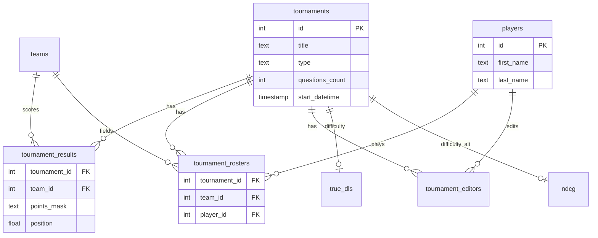

# Схемы данных

Описание таблиц и связей, которые использует ChGK Model. Полная DDL внешней рейтинговой БД живёт в репозитории `rating-db`; здесь — **контракт с точки зрения этого проекта**.

## Файлы

| Документ | Хранилище | Кто пишет |
|----------|-----------|-----------|
| [postgres.md](postgres.md) | PostgreSQL `public.*` | rating-db dump + `rating_api` |
| [api-overlay.md](api-overlay.md) | PostgreSQL `api_overlay.*` | `rating_api` |
| [cache.md](cache.md) | `data.npz`, `results/seq.npz` | `data.py`, `rating` |
| [duckdb.md](duckdb.md) | `website/data/chgk.duckdb` | `website/build/build_db.py` |
| [questions-db.md](questions-db.md) | SQLite `questions.db` | chgk-embedings |
| [venue-overlay.md](venue-overlay.md) | `data/venue_overlay.duckdb` | `venue_overlay/` |

## ER-диаграмма (логическая)

## Идентификаторы в модели

| Внешний ID | Внутренний индекс | Где маппится |
|------------|-------------------|--------------|
| `player_id` | `player_idx` 0..N-1 | `IndexMaps` в `data.py` |
| `(tournament_id, q_index)` | `question_idx` | `IndexMaps.question_id_to_idx` |
| `tournament_id` | `game_idx` | `IndexMaps.idx_to_game_id` |
| paired sync+async | `canonical_q_idx` | `build_canonical_question_idx()` |

## Поддержка в актуальном состоянии

При изменении DDL или колонок, которые читает/пишет код:

1. Обнови соответствующий `schema/*.md`.
2. Если добавилась таблица — добавь в эту страницу и в `docs/INDEX.md`.
3. Источник правды для DuckDB — константа `DDL` в `website/build/build_db.py`.
4. Источник правды для venue overlay — `DDL` в `venue_overlay/store.py`.
5. Источник правды для npz — `CACHE_VERSION_NPZ` в `data.py`, `_export_results_npz` в `rating/__main__.py`.
